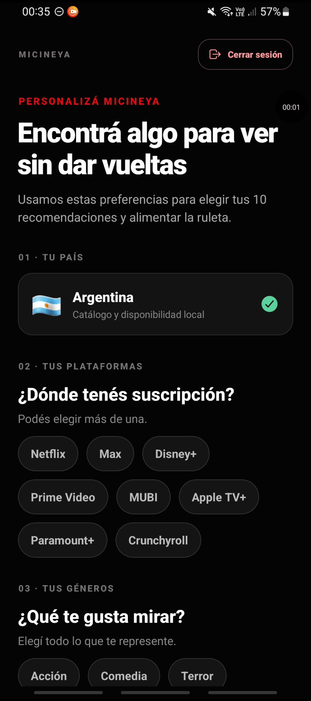
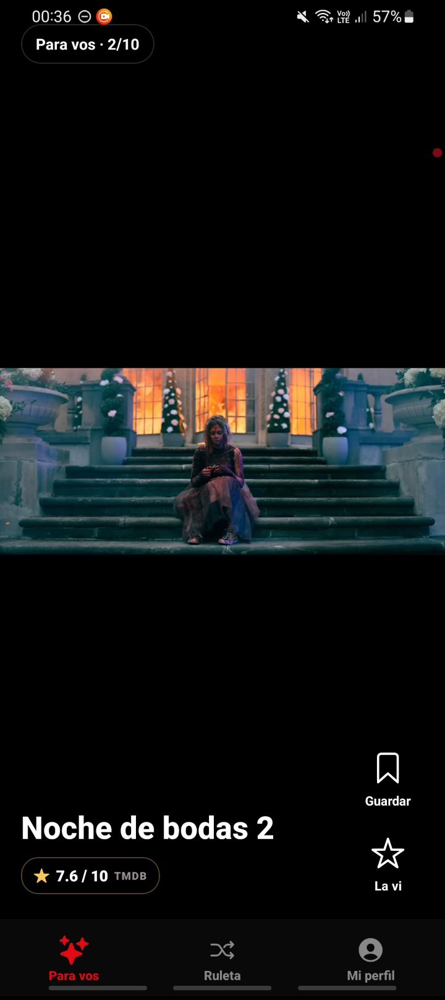
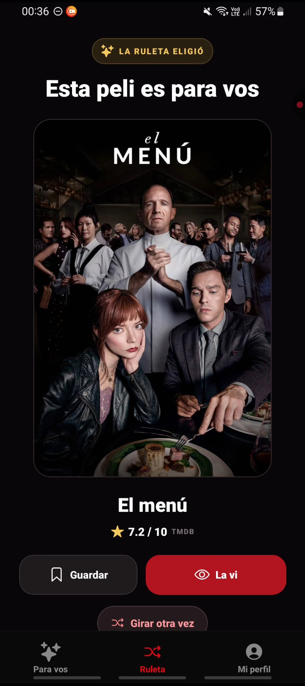
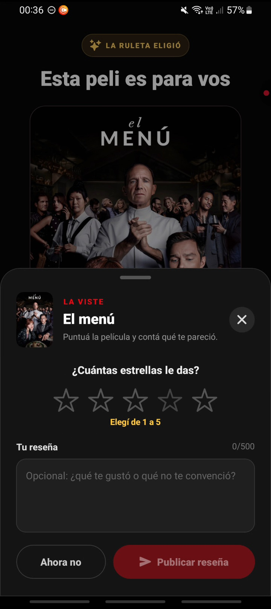
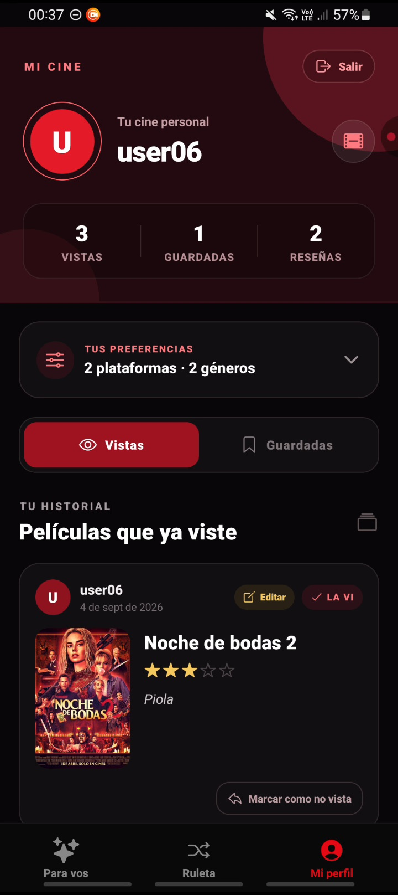
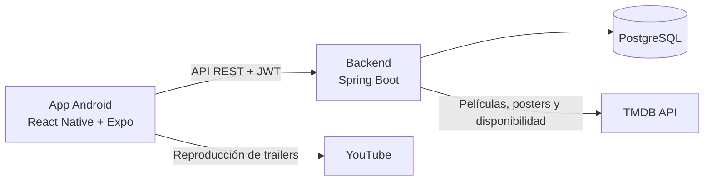

<p align="center">
  
</p>

<h1 align="center">MiCineYa</h1>

<p align="center">
  <strong>Diez recomendaciones, una ruleta y una decisión menos.</strong>
</p>

<p align="center">
  Aplicación móvil que recomienda películas según las plataformas y los géneros elegidos por cada usuario. Si ninguna opción termina de convencerlo, la Cine-Ruleta decide por él.
</p>

<p align="center">
  
  
  
  
</p>

## Capturas

<p align="center">
  
  
  
</p>

<p align="center">
  <sub>Preferencias · Diez recomendaciones · Cine-Ruleta</sub>
</p>

<p align="center">
  
  
</p>

<p align="center">
  <sub>Puntuación y reseña · Perfil personal</sub>
</p>

## El problema

Elegir qué ver suele convertirse en una búsqueda interminable entre catálogos, trailers y listas. MiCineYa reduce esa fricción: conoce los servicios disponibles y los gustos del usuario, presenta solamente diez candidatas y ofrece una decisión al azar cuando hace falta.

## Qué permite hacer

- Crear una cuenta e ingresar con nombre de usuario o correo.
- Mantener la sesión iniciada de forma segura y cerrarla desde Perfil o Preferencias.
- Elegir plataformas de streaming y géneros favoritos.
- Recibir diez recomendaciones personalizadas por vez.
- Explorar trailers en un feed vertical y utilizar los controles nativos de YouTube.
- Consultar la puntuación pública de cada película en TMDB.
- Guardar películas para ver más adelante y quitarlas de la lista.
- Marcar una película como vista, puntuarla de 1 a 5 y escribir una reseña opcional.
- Editar una reseña o deshacer una película marcada por error como vista.
- Usar la Cine-Ruleta para elegir entre las recomendaciones vigentes, excluyendo las películas ya vistas.
- Consultar las películas vistas, reseñas, guardadas y preferencias desde el perfil.

## Flujo principal

1. El usuario crea su cuenta o inicia sesión.
2. Selecciona sus plataformas y géneros preferidos.
3. MiCineYa obtiene diez recomendaciones desde el backend.
4. El usuario puede recorrer los trailers o dejar que la ruleta elija.
5. Finalmente guarda una candidata o registra que ya la vio junto con su puntuación y reseña.

## Tecnologías

| Área | Tecnologías |
| --- | --- |
| Aplicación móvil | React Native, Expo SDK 54 y React 19 |
| Lenguaje | TypeScript |
| Navegación | Expo Router |
| Comunicación HTTP | Axios |
| Sesión local | Expo SecureStore |
| Reproductor | YouTube IFrame para React Native |
| Catálogo | Datos e imágenes de TMDB obtenidos mediante el backend |
| Distribución Android | EAS Build |

El servidor se encuentra en el repositorio [micineya-backend](https://github.com/jesusarnedo9/micineya-backend) y está construido con Java 21, Spring Boot, Spring Security, JWT y PostgreSQL.

## Arquitectura general



El frontend concentra la experiencia móvil, la navegación y el estado de la sesión. El backend administra usuarios, preferencias, recomendaciones, guardadas y reseñas, y funciona como intermediario con TMDB.

## Organización del frontend

```text
src/
├── api/          # Cliente HTTP y acceso a los endpoints
├── app/          # Pantallas y navegación con Expo Router
├── auth/         # Persistencia y renovación de la sesión
├── components/   # Reels, perfil y editor de reseñas
├── context/      # Estado compartido de la experiencia
├── profile/      # Persistencia auxiliar del perfil
└── types/        # Modelos TypeScript
```

## Ejecución local

### Requisitos

- Node.js 20 LTS o superior.
- npm.
- Expo Go o un dispositivo/emulador Android.
- Una instancia compatible del backend.

### Instalación

```bash
git clone https://github.com/jesusarnedo9/micineya_frontend.git
cd micineya_frontend
npm install
npx expo start
```

La aplicación está configurada para consumir el backend desplegado de MiCineYa. La URL base puede modificarse en `src/api/client.ts` para trabajar con otra instancia.

## Verificación y compilación

Comprobar los tipos:

```bash
npx tsc --noEmit
```

Generar un APK de prueba con EAS:

```bash
npx eas-cli build --platform android --profile preview
```

## Estado del proyecto

Series integradas en el código del próximo release: Películas/Series en Para vos y ruleta, perfil mixto,
una reseña por serie y temporadas completas que suman pochoclos. Requiere desplegar primero el backend compatible.
Ver [alcance y prueba del release](docs/releases/1.2-series.md). Pendiente probar el flujo integrado en el teléfono y generar el nuevo APK.

Primera etapa de gamificación: [salón de pochoclos](docs/releases/1.1-pochoclos.md), un balde por cada diez películas distintas, caída animada y colección visible en el perfil público. Mi perfil reúne preferencias desplegables y las secciones Vistas, Guardadas y Logros. Las opciones de cuenta, bloqueados y normas están en el engranaje de Configuración.

El siguiente release agrega **Comunidad**: búsqueda por username, seguir personas, perfiles públicos, feed de reseñas y puntuaciones de seguidos, spoilers, bloqueos y reportes. Las guardadas y preferencias siguen siendo privadas. Antes de compartir el perfil y sus reseñas se solicita aceptar las normas de convivencia.

El panel de moderación solo aparece para cuentas habilitadas en el backend con `MODERATOR_USER_IDS`. Ver [notas de integración de Comunidad](docs/releases/1.1-comunidad.md). Falta probar estas novedades en el próximo APK; no forman parte del APK anterior.

El MVP para Android está completo y permite recorrer el flujo principal de punta a punta. Las siguientes ideas quedan fuera del alcance actual y forman parte de una posible evolución:

- Verificación de correo y recuperación de contraseña.
- Seguimiento por episodio e insignias por completar una serie.
- Preferencias basadas en actores y directores.
- Mejoras de precarga y disponibilidad de trailers.
- Adaptación específica para iOS y una futura versión web.

## Servicios y atribuciones

Este producto utiliza la API de [TMDB](https://www.themoviedb.org/) para información, imágenes y disponibilidad de películas, pero no está respaldado ni certificado por TMDB.

Los trailers se reproducen desde YouTube y su disponibilidad, idioma y publicidad dependen del contenido publicado por terceros.

## Autor

Proyecto personal desarrollado por [Jesús Arnedo](https://github.com/jesusarnedo9) como aplicación full stack y producto móvil funcional.
